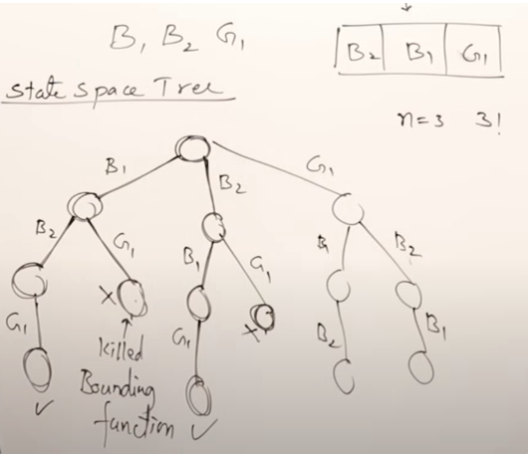

***"Don't even think about the recursion that's happening. Just imagine you are calling a different, working function"*** 

# Introduction

Backtracking is just DFS on tree except there's no pre-defined tree. You have to build your own tree by passing the states through parameters.

## Intuition

Used when you are asked to find all possibilities of something. If the answer is 2^n then there’s no point of optimizing and just brute force with backtracking.

In essence, while backtracking shares the brute force principle of exploring all possibilities, it distinguishes itself by systematically eliminating paths that cannot lead to a solution, thereby streamlining the search process. This ability to prune the search space, coupled with potential for further optimizations, makes backtracking a more nuanced and efficient approach than pure brute force in many scenarios.



**Example:** Girls can’t sit in middle seat so we prune the search space.

# How it Works

1. **Understand the Problem**: Clearly define what the problem is asking. Identify the constraints, the goal, and what constitutes a solution.
2. **Choose a Representation**: Decide how you will represent the solution as you build it. For example, you might use a list, a string, or a matrix, depending on what the problem is.
3. **Identify the Choices**: At each step, understand what choices you can make. This could involve choosing a character for a string, a direction to move on a grid, etc.
4. **Define the Constraints**: Know what conditions must be met at each step. Constraints guide where the algorithm can "branch" into recursive calls and where it should "prune" the search tree to backtrack.
5. **Implement Recursion**: The heart of a backtracking algorithm is a recursive function that attempts to build a solution one piece at a time. Each recursive call should represent a move towards the goal.
6. **Include Base Cases**: Your recursive function should have base cases for stopping recursion, typically when a valid solution is found or when it's clear no solution can be derived from the current path.
7. **Backtrack**: When you reach a dead end (i.e., no valid solution can be found along the current path), backtrack by undoing the last choice, returning to the previous state, and trying a different path.
8. **Optimize**: Look for opportunities to prune unnecessary paths early, using techniques like memoization or cutting off paths that violate constraints.

## Template Code

```python
def solve(problem):
    result = []  # This will hold the final set of solutions
    path = []    # This represents the current path or state
    options = initialize_options(problem)  # Initialize your options based on the problem
    
    def backtrack(result, path, options):
	    if constraint(): # Prune search space
			    return
	    if is_solution(path):
	        result.append(format_solution(path))
	        return
	    
	    for option in options:
	        if is_valid_option(option, path):
	            # Do the choice
	            make_choice(path, option)
	            # Recurse with the choice
	            backtrack(result, path, options)
	            # Undo the choice
	            undo_choice(path, option)
     
    backtrack(result, path, options)
    return result
```

### **Example 1: Permutations of a set of numbers**

Let's consider a simple example problem: generating all possible permutations of a set of numbers.

- **Understand the Problem**: Generate all unique arrangements of a set of numbers.
- **Choose a Representation**: Use a list to represent each permutation.
- **Identify the Choices**: At each step, the choice is which number to add next to the permutation.
- **Define the Constraints**: A number can only appear once in a permutation.
- **Implement Recursion**: Recursively build permutations by choosing a number for the current position and then recurse for the next position.
- **Include Base Cases**: A base case is reached when the length of the permutation equals the length of the input set, indicating a complete permutation.
- **Backtrack**: After exploring one choice (e.g., adding a number to the permutation), remove that choice before making a different choice, effectively backtracking.
- **Optimize**: Use a set or boolean array to quickly check if a number has already been used in the current permutation to prune invalid paths.

```python
def generate_permutations(nums):
    def backtrack(start=0):
        # If the current permutation is complete
        if start == len(nums):
            result.append(nums[:])
        for i in range(start, len(nums)):
            # Swap the current element with the start element
            nums[start], nums[i] = nums[i], nums[start]
            # Recurse on the next element
            backtrack(start + 1)
            # Backtrack
            nums[start], nums[i] = nums[i], nums[start]

    result = []
    backtrack()
    return result

# Example usage
nums = [1, 2, 3]
```

### Example 2: Generate all subsets

1. **Understand the Problem**: We need to generate all possible subsets, including the empty set and the set itself, from a given set of integers.
2. **Choose a Representation**: Use a list to accumulate integers for the current subset.
3. **Identify the Choices**: At each step, the choice is whether to include or exclude the current number in the subset.
4. **Define the Constraints**: There are no explicit constraints other than generating all possible subsets.
    1. The constraint here could be the length of the number
5. **Implement Recursion**: Recursively explore both choices (including or excluding the current number) for each element in the set.
6. **Include Base Cases**: The base case occurs when we've considered every number in the input set.
7. **Backtrack**: After exploring all possibilities with the current number included, backtrack to explore possibilities without it.
8. **Optimize**: While backtracking inherently generates all subsets, optimization might not be needed unless specified, as generating power sets is exponential in nature.

```python
def subsets(nums):
    result = []
    subset = []

    def backtrack(start):
        # Since we want all subsets, add the current subset at the start of exploration
        result.append(subset.copy())

        for i in range(start, len(nums)):
            # Include the number nums[i]
            subset.append(nums[i])
            # Recurse with the next number to explore the current subset deeper
            backtrack(i + 1)
            # Exclude the number, backtrack
            subset.pop()

    backtrack(0)
    return result

subsets([1,2,3])
```

**Debug the code above in VS Code to see how it works**

**Mental Model**

Imagine exploring a tree where each node represents a decision: **to include or not include** a number in the subset. We start at the "root" with an empty subset **`[]`**.

1. **Start**: **`[]`**
    - At the root, our subset is empty. We have three choices (1, 2, 3) to consider adding to our subset.
2. **First Choice**: Add **`1`**
    - Subset becomes **`[1]`**. Now, we have two remaining choices (2, 3) to consider for inclusion.
3. **Explore deeper with `1` included**:
    - Add **`2`** to the subset: **`[1, 2]`**
        - Then, add **`3`**: **`[1, 2, 3]`**. No more numbers to add. We backtrack.
        - Remove **`3`**, backtrack further, subset is **`[1, 2]`**.
    - Remove **`2`**, since no more numbers to add, the subset is back to **`[1]`**.
    - Add **`3`** to the subset: **`[1, 3]`**. No more numbers to add. We backtrack to **`[1]`**.
4. **Backtrack to root**, subset is **`[]`** again.
    - Now, we explore without **`1`** from the start. Add **`2`** to the subset: **`[2]`**.
        - Add **`3`**: **`[2, 3]`**. No more numbers to add. We backtrack to **`[2]`**.
5. **Explore with only `3`**:
    - Starting from an empty subset **`[]`** again, add **`3`**: **`[3]`**. No more numbers to add. We backtrack.

### **Resulting Subsets**

- By following this process, we end up with all subsets:
    - **`[]`**, **`[1]`**, **`[1, 2]`**, **`[1, 2, 3]`**, **`[1, 3]`**, **`[2]`**, **`[2, 3]`**, **`[3]`**
    

```python
                     []
                   /    \
              [1]Y        N[]
             /   \       /   \
       [1,2]Y    N[1]  [2]Y   N[]
         /  \    /  \   /  \   /  \
[1,2,3]Y   N [1,2]Y N[1]Y N[1,3] [3]Y  N[]
```

**Example with Clarity on Exclusion (Moving Right of Tree)**

When you're at a decision point in your backtracking algorithm, you have two choices for each element:

1. **Include the element in your current combination/subset** (moving left in the conceptual decision tree).
2. **Exclude the element from your current combination/subset** (moving right in the conceptual decision tree).

Here's the critical part: when you decide to exclude an element, **you're not doing anything to your current path or combination**. Instead, you're deciding **not to add** the current element to your path and then immediately move on to the next decision.

Let's consider a simple example with **`[1, 2]`** and see how excluding works:

- Start with an empty subset **`[]`**.
- At **`1`**, you have two choices:
    - **Include `1`**: Your path becomes **`[1]`**. Then move to consider **`2`**.
        - At **`2`**, again two choices:
            - **Include `2`**: Path becomes **`[1,2]`**. End of options, add **`[1,2]`** to subsets.
            - **Exclude `2`**: Do nothing to the path; it remains **`[1]`**. End of options, add **`[1]`** to subsets.
    - **Exclude `1`**: Do nothing to the path; it remains **`[]`**. Then move to consider **`2`**.
        - At **`2`**, again two choices:
            - **Include `2`**: Path becomes **`[2]`**. End of options, add **`[2]`** to subsets.
            - **Exclude `2`**: Do nothing to the path; it remains **`[]`**. End of options, add **`[]`** to subsets.