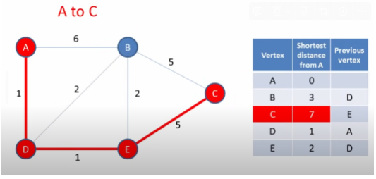
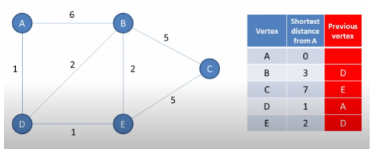
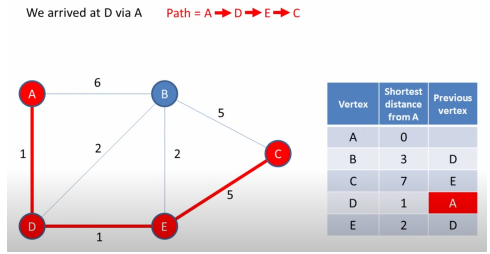
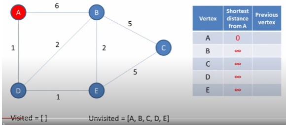
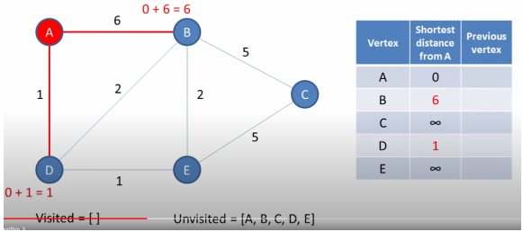
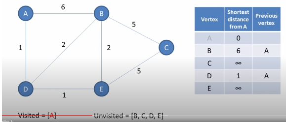
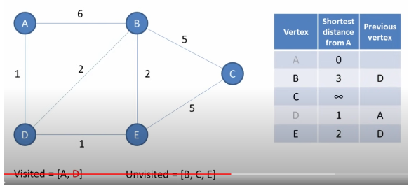
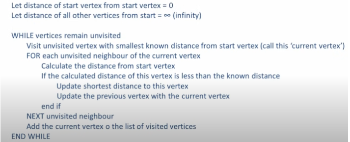
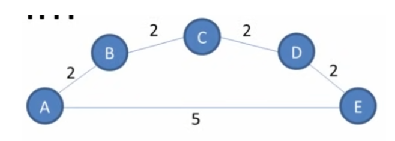

# What is it?

The object of this **greedy** algorithm is to find the shortest path between two vertices on the graph. In fact, Dijkstra’s algorithm will find the shortest path based on the source vertex and any other vertex in the graph.

- **Non-negative Weights**: Dijkstra's algorithm only works correctly with graphs that have non-negative edge weights.
- **Single Source Shortest Path**: It finds the shortest path from a single source node to all other nodes in the graph.
- **Efficiency**: It is more efficient for graphs with non-negative weights due to its use of a priority queue (min-heap).
- **It uses a BFS with a min heap**

## Time Complexity

**Using a min-heap (priority queue)**: O((E+V) log ⁡V) where V is the number of vertices and E is the number of edges.

## When to use it?

- **Non-negative Edge Weights**: Use Dijkstra's algorithm when all edge weights are non-negative.
- **Better Performance**: It is generally faster and more efficient for graphs with non-negative weights, especially if you are using a priority queue to manage the frontier of nodes to explore.
- **Shortest Path Tree**: If you need the shortest path from a single source to all other nodes in a graph with non-negative weights, Dijkstra's is the preferred choice.

# Example

- In the weighted graph below, we are able to place in a chart the shortest distance based on weight from the starting point A.



- It also gives us the shortest sequence of vertices from A to every other vertex. In other words, the shortest path.



- An example of how it works: A to C
    - The previous vertex of C is E
        - Path = E → C
    - The previous vertex of E is D
        - Path = D → E → C
    - The previous vertex of D is A
        - Path = A → D → E → C



# How does it work?

https://www.youtube.com/watch?v=pVfj6mxhdMw

- **Step 1) Track the following:**
    1. Vertices you have visited
    2. Vertices you have NOT visited
- **Step 2) Start from an initial node**, **vertex A:**
    - Distance to A from A = 0
    - Distances to all other vertices from A = Infinity
        - It is unknown, therefore, infinity



- **Step 3) For current vertex (A), consider all of its unvisited neighbors:**
    1. Calculate the distance of each neighbor from the current vertex
    2. If the distance of a vertex is less than the known distance, update with the shortest distance.
        1. The current distance is infinity so we can update both distances.



- **Step 4) Once we have considered all unvisited neighbors, mark the current vertex (A) as visited. Mark the previous vertex of the unvisited neighbors as the current vertex (A).**
    - A will not be visited again.



- **Step 5) Visit the unvisited vertex with the smallest known distance. Vertex D < B.**
    - Repeat the algorithm again from step 3.
    - Remember, if there is a shorter known distance from the start node, assign it with the shorter distance
        - See below, there is a shorter distance from A → B (total 6) if we go to D first which is A → D → B (total 3)



- The algorithm finishes when there are no more unvisited vertices:


### **Summarized steps of algorithm:**



## Template Code

```python
import heapq
from collections import defaultdict

def dijkstra(graph, start):
    # Priority queue (min heap), initialized with the start node. Format: (distance, node)
    pq = [(0, start)]
    
    # Dictionary to store the shortest distance from start to every other node.
    distances = {node: float('inf') for node in graph}
    distances[start] = 0
    
    # Set to keep track of visited nodes
    visited = set()
    
    while pq:
        # Pop the node with the smallest distance
        curr_distance, curr_node = heapq.heappop(pq)
        
        # Skip if the node is already visited
        if curr_node in visited:
            continue
        
        # Mark the node as visited
        visited.add(curr_node)
        
        # Visit all neighbors of the current node
        for neighbor, weight in graph[curr_node].items():
            distance = curr_distance + weight
            
            # If a shorter path to the neighbor is found
            if distance < distances[neighbor]:
                distances[neighbor] = distance
                heapq.heappush(pq, (distance, neighbor))
    
    return distances

# Example graph represented as a dictionary of dictionaries
graph = {
    'A': {'B': 1, 'C': 4},
    'B': {'A': 1, 'C': 2, 'D': 5},
    'C': {'A': 4, 'B': 2, 'D': 1},
    'D': {'B': 5, 'C': 1}
}

# Calculate shortest paths from node 'A'
shortest_paths = dijkstra(graph, 'A')
print(shortest_paths)
```

# Problem with greedy algorithms

Dijkstra’s algorithm is greedy mainly because of the first part of the repeat step:

> Visit the unvisited vertex with the smallest known distance from the start vertex.
> 

The truth is we can select any vertex based on any criteria we’d like but the assumption with this choice is if we choose the shortest distance every time, we’ll get to the end faster.

We are essentially **selecting the most locally optimal choice in each stage in the hope of finding the global optimum.**



Some problems with this choice, is an example of the above graph. If we choose the shortest distance from A to E, then it would end up with unnecessary processing.