- [DFS](#dfs)
  - [DFS in Grid](#dfs-in-grid)
    - [Traversal](#traversal)
    - [Template Code](#template-code)
    - [Example](#example)
  - [DFS in Graphs](#dfs-in-graphs)
    - [Traversal](#traversal-1)
    - [Template Code](#template-code-1)
    - [Template Code - Undirected Graph Traversal](#template-code---undirected-graph-traversal)
- [BFS](#bfs)
  - [BFS in Grid](#bfs-in-grid)
    - [Traversal](#traversal-2)
    - [Template Code Normal Traversal](#template-code-normal-traversal)
    - [Template Code Level Order Traversal](#template-code-level-order-traversal)
  - [BFS in Graphs](#bfs-in-graphs)
    - [Traversal](#traversal-3)
    - [Template Code](#template-code-2)
    - [Template Code - Undirected Graphs](#template-code---undirected-graphs)
    - [Template Code - BFS Level Order Traversal](#template-code---bfs-level-order-traversal)
- [Graph Representation Guide](#graph-representation-guide)
  - [**1. Adjacency List**](#1-adjacency-list)
  - [**2. Adjacency Matrix**](#2-adjacency-matrix)
  - [**3. Edge List**](#3-edgelist)
  - [**4. Graph Class Implementation**](#4-graph-classimplementation)
  - [**5. Object-Oriented Node Representation**](#5-object-oriented-noderepresentation)
  - [Common Graph Operations (DFS, BFS)](#common-graph-operations-dfs-bfs)
  - [Time Complexity Comparison](#time-complexity-comparison)
- [Famous Algorithms](#famous-algorithms)
  - [Dijkstra + Bellman-Ford](#dijkstra--bellman-ford)
  - [Bellman-Ford](#bellman-ford)
  - [Dijkstra](#dijkstra)
- [Topological Sorting (Top Sort)](#topological-sorting-top-sort)
  - [What is it?](#what-is-it)
  - [Directed Acyclic Graphs (DAG)](#directed-acyclic-graphs-dag)
  - [How does the general algorithm work?](#how-does-the-general-algorithm-work)
  - [Example Traversal](#example-traversal)
  - [Example Template](#example-template)
- [Connected Components](#connected-components)
  - [Overview and Applications](#overview-and-applications)
  - [Directed Graphs](#directed-graphs)
    - [Strongly Connected Components (SCC)](#strongly-connected-components-scc)
      - [Template Code: Kosaraju's Algorithm](#template-code-kosarajus-algorithm)
      - [Template Code: Tarjan's Algorithm](#template-code-tarjans-algorithm)
    - [Weakly Connected Components (WCC)](#weakly-connected-components-wcc)
      - [Template Code: Finding WCCs](#template-code-finding-wccs)
  - [Undirected Graphs](#undirected-graphs)
    - [Template Code: DFS Approach](#template-code-dfs-approach)
    - [Template Code: BFS Approach](#template-code-bfs-approach)
    - [Template Code: Union-Find Approach](#template-code-union-find-approach)
  - [Grid-Based Connected Components](#grid-based-connected-components)
    - [Template Code: Finding Islands in a Grid](#template-code-finding-islands-in-a-grid)
  - [Biconnected Components](#biconnected-components)
    - [Template Code: Finding Biconnected Components](#template-code-finding-biconnected-components)
  - [Common Interview Problems](#common-interview-problems)
- [Union Find](#union-find)
- [Possible Interview Questions](#possible-interview-questions)

# DFS

## DFS in Grid


1. The cell that we are on (blue cell), is directly connected to four different cells (left, right, up, down) due to the **edges** of the cell.
2. We are able to make four recursive calls that goes up, down, right, or left.
    1. **NOTE:** If the corners are also considered as edges, then we must add more conditions.
3. Each cell is specified with: # of row, # of column

### Traversal

***Keep in mind that x is rows and y is column.***

1. Mark the current cell we are on as visited:  `visited[x][y]` 
    1. Prevents the traversal of already visited nodes
2. Before we traverse we need to check if the direction we are going to is valid.
    1. Check if the cell exists
    2. Check if there is a certain condition why we would not want to go to that cell (its a boundary, value we don't want to traverse to, etc.)
    3. Check if the cell is already visited

### Template Code

```python
def dfs(grid, x, y):
    # Check boundaries and if the current cell is valid for exploration
    if x < 0 or x >= len(grid) or y < 0 or y >= len(grid[0]) or not isValid(grid, x, y):
        return
    
    # Process the current cell
    # For example, mark it as visited (this might vary depending on the problem)
    markAsVisited(grid, x, y)
    
    # Explore neighboring cells (up, down, left, right)
    # Optionally, include diagonals or other specific movements based on the problem
    dfs(grid, x+1, y)  # Down
    dfs(grid, x-1, y)  # Up
    dfs(grid, x, y+1)  # Right
    dfs(grid, x, y-1)  # Left

def isValid(grid, x, y):
    # Implement the condition to determine if the current cell is valid for exploration
    # Example condition: cell is not visited and is of a specific type (e.g., land)
    return grid[x][y] == 1

def markAsVisited(grid, x, y):
    # Mark the cell as visited to avoid revisiting
    # The mechanism to mark it will depend on the problem's requirements
    grid[x][y] = 0  # Example: mark visited cells by changing their value
```

### Example


## DFS in Graphs

- Allows to easily solve puzzles since we can backtrack.
- Great for going as deep as possible in a graph to check if something exists.

### Traversal

1. Visiting a vertex
    1. Can begin at any node
2. Exploration of a vertex
    1. Can only visit one node as deep as possible at a time


How to use DFS to traverse example above:

1. Begin at node 1
    1. Go to node 2
    2. Explore to node 3, no other adjacent vertices, so go back to node 2
2. Now at node 2, go as deep as possible to non-visited nodes
    1. Go to node 7, no other adjacent vertices, go back to 2.
    2. Go to node 6, no other vertices, now go ALL the way back to node 1.
3. Back at node 1
    1. Go to node 5, no where else to go so back to node 1
    2. Go to node 4, no where else
4. We finished and we traversed from 1 → 2 → 7 → 6 → 5 → 4

### Template Code

**Recursive Implementation**

```python
def dfs(graph, node, visited):
    if node in visited:
	    return
    print(node)  # Process the node
    visited.add(node)  # Mark the node as visited
    for neighbor in graph[node]:
        dfs(graph, neighbor, visited)

# Example usage
graph = {
    'A': ['B', 'C'],
    'B': ['A', 'D', 'E'],
    'C': ['A', 'F'],
    'D': ['B'],
    'E': ['B', 'F'],
    'F': ['C', 'E']
}

visited = set()  # Use a set to keep track of visited nodes
dfs(graph, 'A', visited)  # Start DFS from node 'A'
```

**Iterative Implementation**

```python
def dfs_iterative(graph, start_node):
    visited = set()  # Keeps track of visited nodes
    stack = [start_node]  # Stack to manage the nodes to be visited next, starting with the start_node
    
    while stack:
        current_node = stack.pop()  # Take the last node added to the stack
        if current_node not in visited:
            print(current_node)  # Process the current node
            visited.add(current_node)  # Mark the current node as visited
            
            # Add unvisited neighbors to the stack
            # Reverse the order of neighbors to match the order of recursive DFS exploration
            neighbors_to_visit = [neighbor for neighbor in graph[current_node] if neighbor not in visited]
            stack.extend(reversed(neighbors_to_visit))

# Example graph representation
graph = {
    'A': ['B', 'C'],
    'B': ['A', 'D', 'E'],
    'C': ['A', 'F'],
    'D': ['B'],
    'E': ['B', 'F'],
    'F': ['C', 'E']
}

# Perform DFS starting from node 'A'
dfs_iterative(graph, 'A')
```

### Template Code - Undirected Graph Traversal

```python
def validTree(self, n: int, edges: List[List[int]]) -> bool:
  if not n:
      return True
  
  visited = set()
  graph = {v: [] for v in range(n)}

  # Create an bi-directional graph (undirected)
  for x, y in edges:
      graph[x].append(y)
      graph[y].append(x) # Connect it bi-directionally since its undirected

  def dfs(source, prev):
      # Check if a cycle is detected
      if source in visited:
          return False
      
      visited.add(source)
      for adj in graph[source]:
          # Don't do a DFS on the neighbor we just traversed from since we have visited it already
              # Prevents detecting a cycle this way!!!!!!!
          if adj == prev:
              continue
          
          # Explore the next neighbors and add the current node we are on as the previous
          if not dfs(adj, source):
              return False
      
      return True
  
  # DFS checks if there is a cycle
  # Length of visited checks if all of the vertices are connected
  return dfs(0, -1) and len(visited) == n
```

# BFS

## BFS in Grid


Similar to DFS, we traverse in multiple different directions. Up, right, left, down or corners as well if its part of the requirements

### Traversal

1. Mark visited nodes (cells)
2. Continuously adds all edges to queue
3. Pops the node and checks if the node is valid to traverse to, else continue

Think of it as a burst traversal compared to DFS that goes as deep as possible

### Template Code Normal Traversal

```python
def bfs(grid, start_row, start_col):
    if not isValid(grid, start_row, start_col):
        return  # Starting point is not valid

    # Directions for moving up, down, left, and right
    directions = [(-1, 0), (1, 0), (0, -1), (0, 1)]
    # Optionally, include diagonals: directions += [(-1, -1), (-1, 1), (1, -1), (1, 1)]
    
    queue = deque([(start_row, start_col)])

    while queue:
        row, col = queue.popleft()
        
        # Process the cell at (row, col)...
        if not isValid(grid, new_row, new_col):
		        continue
		   
        markAsVisited(grid, row, col)
        
        # Explore all possible directions
        for dr, dc in directions:
            new_row, new_col = row + dr, col + dc
            queue.append((new_row, new_col))

def isValid(grid, row, col):
    # Check if (row, col) is within the grid and is a cell we want to explore
    return 0 <= row < len(grid) and 0 <= col < len(grid[0]) and grid[row][col] == 1

def markAsVisited(grid, row, col):
    # Update the cell to indicate it has been visited
    # This example sets visited cells to 0, adapt as needed based on the problem
    grid[row][col] = 0
```

### Template Code Level Order Traversal

```python
from collections import deque

def bfs(grid, start_row, start_col):
    if not isValid(grid, start_row, start_col):
        return  # Starting point is not valid

    # Directions for moving up, down, left, and right
    directions = [(-1, 0), (1, 0), (0, -1), (0, 1)]
    # Optionally, include diagonals: directions += [(-1, -1), (-1, 1), (1, -1), (1, 1)]
    
    queue = deque([(start_row, start_col)]) 
    
    # MAKE SURE TO MARK THE BEGINNING NODE AS VISITED
    markAsVisited(grid, start_row, start_col)  # Mark the start position as visited initially

    while queue:
        level_size = len(queue)  # Get the current level size
        for _ in range(level_size):
            row, col = queue.popleft()
            
            # Process the cell at (row, col)...
            # Perform any required action with the current cell, e.g., check, modify
            
            # Explore all possible directions
            for dr, dc in directions:
                new_row, new_col = row + dr, col + dc
                if isValid(grid, new_row, new_col):
                    markAsVisited(grid, new_row, new_col)  # Mark as visited before enqueueing
                    queue.append((new_row, new_col))

def isValid(grid, row, col):
    # Check if (row, col) is within the grid and is a cell we want to explore
    return 0 <= row < len(grid) and 0 <= col < len(grid[0]) and grid[row][col] == 1

def markAsVisited(grid, row, col):
    # Update the cell to indicate it has been visited
    # This example sets visited cells to 0, adapt as needed based on the problem
    grid[row][col] = 0
```

## BFS in Graphs

- Used to find the shortest path
- Traverses through all adjacent vertices

### Traversal

1. Visiting a vertex
    1. Can begin at any node
2. Exploration of a vertex
    1. Visit all adjacent vertices in any order


How BFS traversal works based on example above:

1. Starting at node 1
    1. Visit all adjacent vertices: 5, 4, 2. 
    2. We can visit in any order.
2. Visit 1 → 2 → 4 → 5
    1. Begin exploration on 2, 4, 5
3. At node 2
    1. Adjacent vertices at 7, 6, 3.
4. At node 4
    1. No other adjacent vertices to traverse to.
5. At node 5
    1. No other adjacent vertices to traverse to.
6. Visit 7 → 6 → 3
    1. No other nodes to explore.
7. We have in visited all nodes 1 → 2 → 4 → 5 → 7 → 6 → 3

### Template Code

```python
from collections import deque, defaultdict

def bfs_directed(graph, start_node):
    visited = set()  # Set to keep track of visited nodes to prevent revisiting
    queue = deque([start_node])  # Initialize a queue with the start node
    
    visited.add(start_node)  # Mark the start node as visited

    while queue:
        current_node = queue.popleft()  # Dequeue a node from the queue
        print(current_node)  # Process the node as needed

        # Enqueue all unvisited neighbors
        for neighbor in graph[current_node]:
            if neighbor not in visited:
                visited.add(neighbor)  # Mark the neighbor as visited
                queue.append(neighbor)  # Enqueue the neighbor

# Example usage
graph_directed = defaultdict(list)
edges_directed = [(0, 1), (0, 2), (1, 2), (2, 3), (3, 4)]
for u, v in edges_directed:
    graph_directed[u].append(v)  # Only add the edge in one direction for directed graph

print("BFS (Directed Graph):")
bfs_directed(graph_directed, 0)

```

### Template Code - Undirected Graphs

**Undirected graph traversal is the same as BFS directed graph traversal.**

```python
from collections import deque, defaultdict

def bfs_undirected(graph, start_node):
    visited = set()  # Set to keep track of visited nodes to prevent revisiting
    queue = deque([start_node])  # Initialize a queue with the start node
	  
	  # Visit the start node right away
    visited.add(start_node)  # Mark the start node as visited

    while queue:
        current_node = queue.popleft()  # Dequeue a node from the queue
        print(current_node)  # Process the node as needed

        # Enqueue all unvisited neighbors
        for neighbor in graph[current_node]:
            if neighbor not in visited:
                visited.add(neighbor)  # Mark the neighbor as visited
                queue.append(neighbor)  # Enqueue the neighbor

# Example usage
graph_undirected = defaultdict(list)
edges_undirected = [(0, 1), (0, 2), (1, 2), (2, 3), (3, 4)]
for u, v in edges_undirected:
    graph_undirected[u].append(v)
    graph_undirected[v].append(u)  # Add both directions for undirected graph

print("BFS (Undirected Graph):")
bfs_undirected(graph_undirected, 0)

```

### Template Code - BFS Level Order Traversal

```python
class Solution:
    def ladderLength(self, beginWord: str, endWord: str, wordList: List[str]) -> int:
        if endWord not in wordList:
            return 0
        
        wordList.append(beginWord)

        graph = defaultdict(list)
        for word in wordList:
            for i in range(len(word)):
                # word[:i], get everything until the index
                # word[i+1:], get everything after index
                # E.g. *ot, h*t, ho*
                pattern = word[:i] + "*" + word[i+1:]
                graph[pattern].append(word) # Undirected graph
        
        queue = deque([beginWord])
        visit = set([beginWord])
        count = 1 # Begin with 1 since we are visiting beginWord right away
        
        # BFS level order traversal
        while queue:
            levelSize = len(queue)
            for _ in range(levelSize):
                curr = queue.popleft()

                # When we reach the end word, no need to continue
                if curr == endWord:
                    return count
                
                # Create the patterns for the length of current word
                for i in range(len(curr)):
                    pattern = curr[:i] + "*" + curr[i+1:]
                    for nei in graph[pattern]:
                        # Visit the neighbours of the current word patterns
                        if nei not in visit:
                            visit.add(nei)
                            queue.append(nei)
            count += 1
        
        return 0

```

# Graph Representation Guide

## **1. Adjacency List**

Most common and space-efficient for sparse graphs. Uses a dictionary or list to store nodes and their neighbors.

**Use Adjacency List when**:

- Graph is sparse (E << V²)
- Need to find neighbours quickly
- Memory is a concern
- Most common choice for interviews

```python
# Using dictionary (most flexible)
graph = {
    'A': ['B', 'C'],
    'B': ['A', 'D'],
    'C': ['A', 'D'],
    'D': ['B', 'C']
}

# Using defaultdict
from collections import defaultdict
graph = defaultdict(list)
edges = [('A', 'B'), ('B', 'C')]
for u, v in edges:
    graph[u].append(v)
    # For undirected: graph[v].append(u)

# Using list for 0-indexed nodes
graph = [[] for _ in range(n)]  # n = number of nodes
edges = [[0, 1], [1, 2]]
for u, v in edges:
    graph[u].append(v)
    # For undirected: graph[v].append(u)
```

## **2. Adjacency Matrix**

Good for dense graphs. Uses a 2D matrix where matrix[i][j] represents edge from i to j.

**Use Adjacency Matrix when**:

- Graph is dense (E ≈ V²)
- Need to check edge existence quickly
- Graph is weighted
- Memory is not a concern

```python
# Using 2D list
n = 4  # number of nodes
graph = [[0] * n for _ in range(n)]
edges = [[0, 1], [1, 2]]
for u, v in edges:
    graph[u][v] = 1  # or weight if weighted
    # For undirected: graph[v][u] = 1

# Using numpy (more efficient for large graphs)
import numpy as np
graph = np.zeros((n, n))
for u, v in edges:
    graph[u][v] = 1
```

## **3. Edge List**

Simple list of edges. Good when you need to process edges directly.

**Use Edge List when**:

- Need to process edges directly
- Implementing algorithms like Kruskal's
- Graph is constantly changing

```python
# Simple edge list
edges = [(0, 1), (1, 2), (2, 3)]

# Weighted edge list
weighted_edges = [(0, 1, 5), (1, 2, 3)]  # (from, to, weight)
```

## **4. Graph Class Implementation**

For more complex graph operations.

```python
class Graph:
    def __init__(self, directed=False):
        self.graph = defaultdict(list)
        self.directed = directed
    
    def add_edge(self, u, v, weight=1):
        self.graph[u].append((v, weight))
        if not self.directed:
            self.graph[v].append((u, weight))
    
    def get_neighbors(self, node):
        return self.graph[node]

# Usage
g = Graph()
g.add_edge(0, 1)
g.add_edge(1, 2)
```

## **5. Object-Oriented Node Representation**

Useful for complex graph problems where nodes need to store additional information.

```python
class Node:
    def __init__(self, val=0):
        self.val = val
        self.neighbors = []
        # Additional attributes as needed
        self.visited = False
        self.parent = None
        self.distance = float('inf')

class Graph:
    def __init__(self):
        self.nodes = {}
    
    def add_node(self, val):
        if val not in self.nodes:
            self.nodes[val] = Node(val)
    
    def add_edge(self, u, v):
        if u not in self.nodes:
            self.add_node(u)
        if v not in self.nodes:
            self.add_node(v)
        self.nodes[u].neighbors.append(self.nodes[v])
```

## Common Graph Operations (DFS, BFS)

```python
def bfs(graph, start):
    visited = set()
    queue = deque([start])
    visited.add(start)
    
    while queue:
        node = queue.popleft()
        for neighbor in graph[node]:
            if neighbor not in visited:
                visited.add(neighbor)
                queue.append(neighbor)

def dfs(graph, node, visited=None):
    if visited is None:
        visited = set()
    
    visited.add(node)
    for neighbor in graph[node]:
        if neighbor not in visited:
            dfs(graph, neighbor, visited)
```

## Time Complexity Comparison

```python
| Operation      | Adjacency List | Adjacency Matrix | Edge List |
|----------------|----------------|------------------|-----------|
| Add Edge       | O(1)           | O(1)             | O(1)      |
| Remove Edge    | O(E)           | O(1)             | O(E)      |
| Find Edge      | O(V)           | O(1)             | O(E)      |
| Get Neighbors  | O(V)           | O(V)             | O(E)      |
| Space          | O(V + E)       | O(V²)            | O(E)      |

Where:
- \( V \) = number of vertices
- \( E \) = number of edges
```

# Famous Algorithms

## Dijkstra + Bellman-Ford

- Used for **Shortest Path** problems for **weighted graphs.**
    - BFS is great for the shortest path problem but one thing it cant do.
        - It completely disregards weight in an edge.

## Bellman-Ford

- More effective solving a shortest path compared to Dijkstra's algorithm
    - Because it **can accommodate negative weights.**
- Can take a long time to run in terms of complexity.
- **Not the most efficient algorithm.**
    - Worst case is O(n^2)

## Dijkstra

- Also effective at solving a shortest path but does not accommodate
negative weights.
- However, it is a lot faster than Bellman-Ford algorithm and more
efficient.

# Topological Sorting (Top Sort)

Has a runtime complexity of O(Vertices+Edges) time.

## What is it?

It is an ordering of the nodes in a directed graph where for each directed edge from node A to node B, node A appears before node B.

Used to model real world situations that can be represented as a graph with directed edges that has dependencies

- School class prerequisites, example, you can't take courses that you don't have prerequisites for.

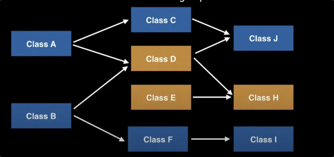

- Program dependencies, for example, you want to build program J so you would need H and G then E and F then C, B and D and so on.

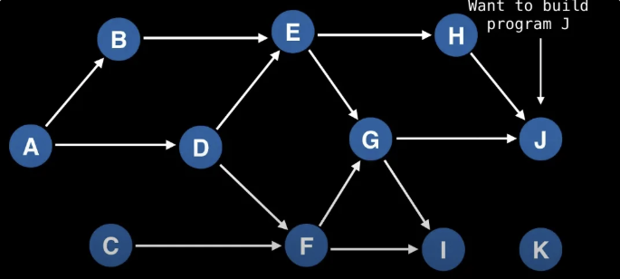

- Event scheduling

## Directed Acyclic Graphs (DAG)

- The only type of graph that has a valid topological ordering is a Directed Acyclic Graph.
    - To verify that your graph does not contain a cycle, you can use Tarjan's strongly connected component algorithm to detect cycles.
- Every tree has a topological ordering since they do not contain any cycles


- To see how topological ordering works for a tree, keep picking off leaf nodes in any order until you reach the root node

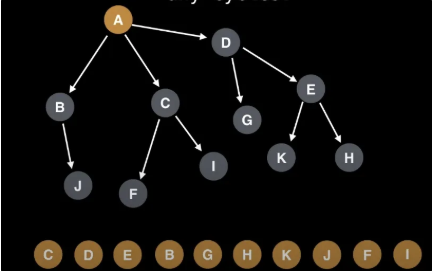

## How does the general algorithm work?

1. Pick an unvisited node
2. With the first node, do a DFS exploring only unvisited nodes
3. On the recursive stack pop of the DFS, add the current node to the topological ordering in reverse order.

## Example Traversal

Step 1) Pick Node H

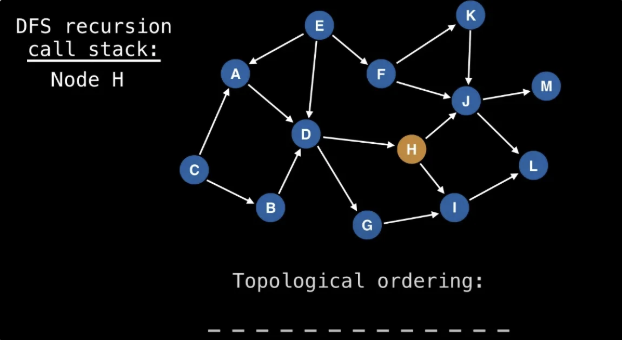

Step 2) DFS and explore unvisited nodes. H → J → M

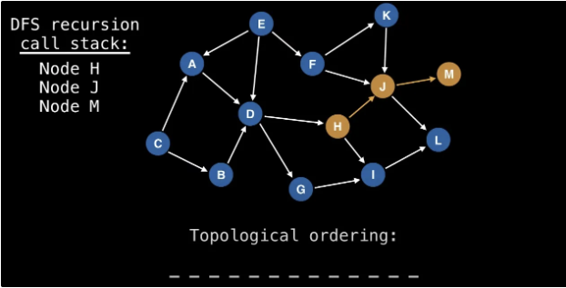

Step 3) Pop recursive stack of M and backtrack to J and then explore L. Every time stack recursion pops add to topological ordering.

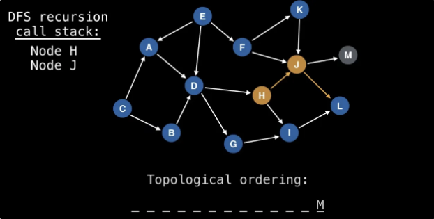

Step 4) Backtrack from L and then to J then back to H.

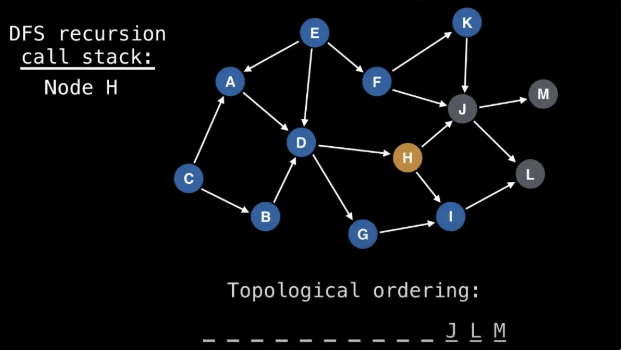

Step 5) From H, visit I and then backtrack to H

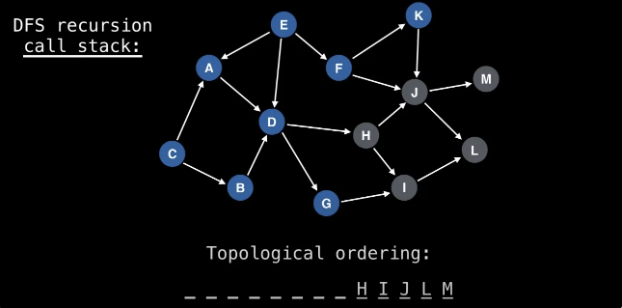

## Example Template

```python
from collections import defaultdict

class TopologicalSort:
    def solve(self, n: int, prerequisites: List[List[int]]) -> bool:
        # 1. Build adjacency list
        adj = defaultdict(list)
        for crs, pre in prerequisites:
            adj[crs].append(pre)
        
        # 2. Initialize visit sets for cycle detection
        visit = set()      # Current path being explored
        done = set()       # Completed nodes (fully explored)
        
        def dfs(crs):
            # Base cases
            if crs in done:
                return True     # Already verified, no cycles
            if crs in visit:
                return False    # Cycle detected
            
            # Add to current path
            visit.add(crs)
            
            # Explore all prerequisites
            for pre in adj[crs]:
                if not dfs(pre):
                    return False
            
            # Backtrack: remove from path and mark as done
            visit.remove(crs)
            done.add(crs)
            return True
        
        # 3. Check all nodes (handles disconnected components)
        for crs in range(n):
            if not dfs(crs):
                return False
        
        return True

    # Variation: Return the topological order
    def findOrder(self, n: int, prerequisites: List[List[int]]) -> List[int]:
        # 1. Build adjacency list
        adj = defaultdict(list)
        for crs, pre in prerequisites:
            adj[crs].append(pre)
        
        # 2. Initialize states and result
        visit = set()
        done = set()
        order = []
        
        def dfs(crs):
            if crs in done:
                return True
            if crs in visit:
                return False
            
            visit.add(crs)
            
            for pre in adj[crs]:
                if not dfs(pre):
                    return False
            
            visit.remove(crs)
            done.add(crs)
            order.append(crs)  # Add to order after exploring all prerequisites
            return True
        
        # 3. Process all nodes
        for crs in range(n):
            if not dfs(crs):
                return []
        
        return order
```

# Connected Components

Connected components are fundamental structures in graph theory that help us understand the connectivity patterns within a graph. They are crucial for solving many graph-related problems in coding interviews.

## Overview and Applications

**What are Connected Components?**
- Subgraphs where any two vertices are connected by a path
- Used to identify isolated "islands" of connectivity
- Critical for network analysis, image segmentation, and social network clustering

**Common Applications in Interviews:**
- Island counting problems (e.g., count number of islands in a grid)
- Network connectivity problems
- Community detection in social networks
- Image segmentation and object recognition

**Time Complexity Analysis:**
- Finding all connected components: O(V + E) using DFS or BFS
- Checking if two nodes are in the same component: O(V + E) for a one-time check, or O(1) with preprocessing using Union-Find

## Directed Graphs

### Strongly Connected Components (SCC)

**Definition:** A subset of vertices in a directed graph where every vertex is reachable from every other vertex within the same subset.

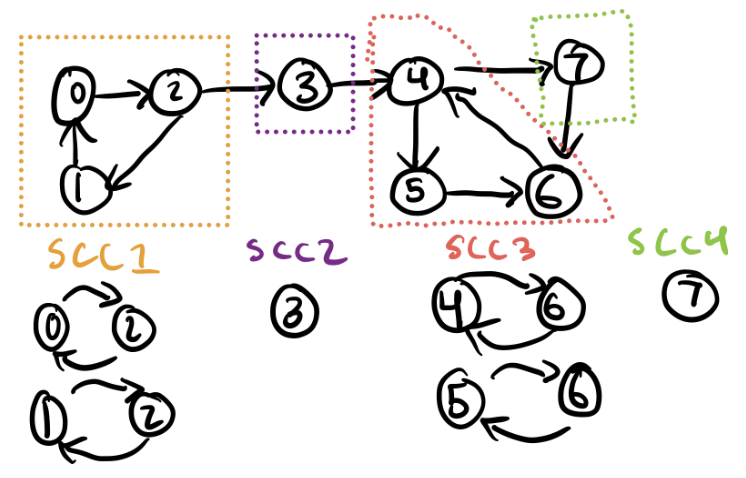

**Properties:**
- SCCs form a partition of the graph
- The condensation graph (treating each SCC as a single vertex) is always a DAG
- Used to simplify complex directed graphs

**Benefits:**
- Identifies cycles in directed graphs
- Helps in solving problems related to graph reachability
- Useful for analyzing dependencies in systems

**Algorithms:**
1. **Kosaraju's Algorithm** - Two-pass DFS approach
   - Time Complexity: O(V + E)
   - Space Complexity: O(V)
2. **Tarjan's Algorithm** - Single-pass DFS with lowlink values
   - Time Complexity: O(V + E)
   - Space Complexity: O(V)

#### Template Code: Kosaraju's Algorithm

```python
from collections import defaultdict

def find_sccs(graph):
    """
    Find all strongly connected components in a directed graph using Kosaraju's algorithm.
    
    Args:
        graph: Dictionary representing adjacency list of the graph
        
    Returns:
        List of lists, where each inner list contains vertices in one SCC
    """
    def dfs_first_pass(node):
        visited.add(node)
        for neighbor in graph[node]:
            if neighbor not in visited:
                dfs_first_pass(neighbor)
        finish_order.append(node)
    
    def dfs_second_pass(node, component):
        visited.add(node)
        component.append(node)
        for neighbor in reversed_graph[node]:
            if neighbor not in visited:
                dfs_second_pass(neighbor, component)
    
    # Create reversed graph
    reversed_graph = defaultdict(list)
    for node in graph:
        for neighbor in graph[node]:
            reversed_graph[neighbor].append(node)
    
    # First DFS pass to get finish order
    visited = set()
    finish_order = []
    for node in graph:
        if node not in visited:
            dfs_first_pass(node)
    
    # Second DFS pass to find SCCs
    visited = set()
    sccs = []
    for node in reversed(finish_order):
        if node not in visited:
            component = []
            dfs_second_pass(node, component)
            sccs.append(component)
    
    return sccs

# Example usage
graph = {
    0: [1],
    1: [2],
    2: [0, 3],
    3: [4],
    4: [5, 7],
    5: [6],
    6: [4, 7],
    7: []
}
sccs = find_sccs(graph)
print("Strongly Connected Components:", sccs)
```

#### Template Code: Tarjan's Algorithm

```python
def tarjan_scc(graph):
    """
    Find all strongly connected components in a directed graph using Tarjan's algorithm.
    
    Args:
        graph: Dictionary representing adjacency list of the graph
        
    Returns:
        List of lists, where each inner list contains vertices in one SCC
    """
    index_counter = [0]
    index = {}  # node -> index
    lowlink = {}  # node -> lowlink value
    onstack = set()  # nodes currently on the stack
    stack = []
    result = []
    
    def strongconnect(node):
        # Set the depth index for node
        index[node] = index_counter[0]
        lowlink[node] = index_counter[0]
        index_counter[0] += 1
        stack.append(node)
        onstack.add(node)
        
        # Consider successors of node
        for successor in graph.get(node, []):
            if successor not in index:
                # Successor has not yet been visited; recurse on it
                strongconnect(successor)
                lowlink[node] = min(lowlink[node], lowlink[successor])
            elif successor in onstack:
                # Successor is in stack and hence in the current SCC
                lowlink[node] = min(lowlink[node], index[successor])
        
        # If node is a root node, pop the stack and generate an SCC
        if lowlink[node] == index[node]:
            scc = []
            while True:
                successor = stack.pop()
                onstack.remove(successor)
                scc.append(successor)
                if successor == node:
                    break
            result.append(scc)
    
    for node in graph:
        if node not in index:
            strongconnect(node)
    
    return result
```

### Weakly Connected Components (WCC)

**Definition:** A subset of vertices in a directed graph where every vertex is reachable from every other vertex, if the direction of the edges is ignored. It's as if all edges were undirected.

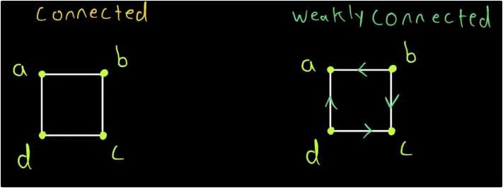

Sometimes weakly connected just means connected but it becomes **weakly** if the directed graph's vertices are not reachable in other vertices. E.g. A → C cannot be reached above.

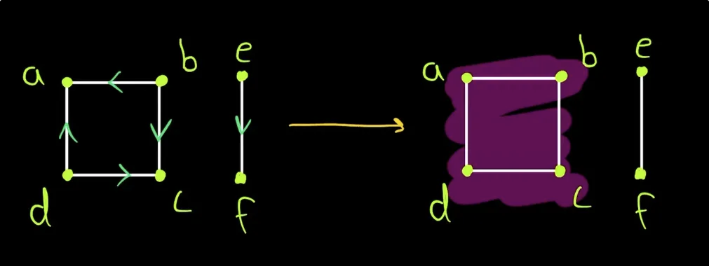

**Properties:**
- Every SCC is contained within a WCC
- A directed graph can have fewer SCCs than WCCs
- Easier to compute than SCCs

**Benefits:**
- Simpler to identify than SCCs
- Useful for preliminary graph analysis
- Can be found using standard BFS/DFS by ignoring edge directions

**Algorithm:**
- Convert the directed graph to undirected
- Run standard connected components algorithm (BFS/DFS)
- Time Complexity: O(V + E)

#### Template Code: Finding WCCs

```python
from collections import defaultdict, deque

def find_wccs(directed_graph):
    """
    Find all weakly connected components in a directed graph.
    
    Args:
        directed_graph: Dictionary representing adjacency list of the directed graph
        
    Returns:
        List of lists, where each inner list contains vertices in one WCC
    """
    # Convert directed graph to undirected
    undirected_graph = defaultdict(list)
    for node in directed_graph:
        for neighbor in directed_graph[node]:
            undirected_graph[node].append(neighbor)
            undirected_graph[neighbor].append(node)
    
    # Find connected components in the undirected graph
    visited = set()
    components = []
    
    def bfs(start_node):
        component = []
        queue = deque([start_node])
        visited.add(start_node)
        
        while queue:
            node = queue.popleft()
            component.append(node)
            
            for neighbor in undirected_graph[node]:
                if neighbor not in visited:
                    visited.add(neighbor)
                    queue.append(neighbor)
        
        return component
    
    for node in undirected_graph:
        if node not in visited:
            components.append(bfs(node))
    
    return components

# Example usage
directed_graph = {
    'A': ['B'],
    'B': ['C'],
    'C': [],
    'D': ['E'],
    'E': ['F'],
    'F': []
}
wccs = find_wccs(directed_graph)
print("Weakly Connected Components:", wccs)
```

For a graph to be **connected** the underlying graph of a directed graph has to be connected. So the graph above is called **disconnected** since vertices from A to C cannot reach E to F.

## Undirected Graphs

For an undirected graph, connected components are simply the subsets of vertices where each vertex is reachable from every other vertex within the same subset, without considering any directionality of edges (since the edges are undirected). Each component is, in essence, an isolated "island" of connectivity.

```
    1---2       3
     \ /       / \
      4       5---6
               \
                7
```

In this graph, there are two connected components:

1. **Component 1:** Consists of vertices **`{1, 2, 4}`**. These vertices are all connected to each other directly or indirectly through undirected paths.
2. **Component 2:** Consists of vertices **`{3, 5, 6, 7}`**. These vertices form another separate group where each vertex is reachable from every other vertex in the same group.

**Algorithms for Finding Connected Components:**
1. **DFS-based approach** - O(V + E)
2. **BFS-based approach** - O(V + E)
3. **Union-Find (Disjoint Set)** - O(V + E·α(V)) where α is the inverse Ackermann function

**Benefits:**
- Identifies isolated subgraphs
- Useful for network analysis
- Essential for solving island counting problems

### Template Code: DFS Approach

```python
def find_connected_components_dfs(graph):
    """
    Find all connected components in an undirected graph using DFS.
    
    Args:
        graph: Dictionary representing adjacency list of the undirected graph
        
    Returns:
        List of lists, where each inner list contains vertices in one connected component
    """
    visited = set()
    components = []
    
    def dfs(node, component):
        visited.add(node)
        component.append(node)
        for neighbor in graph[node]:
            if neighbor not in visited:
                dfs(neighbor, component)
    
    for node in graph:
        if node not in visited:
            component = []
            dfs(node, component)
            components.append(component)
    
    return components

# Example usage
undirected_graph = {
    1: [2, 4],
    2: [1, 4],
    3: [5, 6],
    4: [1, 2],
    5: [3, 6, 7],
    6: [3, 5],
    7: [5]
}
components = find_connected_components_dfs(undirected_graph)
print("Connected Components:", components)
```

### Template Code: BFS Approach

```python
from collections import deque

def find_connected_components_bfs(graph):
    """
    Find all connected components in an undirected graph using BFS.
    
    Args:
        graph: Dictionary representing adjacency list of the undirected graph
        
    Returns:
        List of lists, where each inner list contains vertices in one connected component
    """
    visited = set()
    components = []
    
    def bfs(start_node):
        component = []
        queue = deque([start_node])
        visited.add(start_node)
        
        while queue:
            node = queue.popleft()
            component.append(node)
            
            for neighbor in graph[node]:
                if neighbor not in visited:
                    visited.add(neighbor)
                    queue.append(neighbor)
        
        return component
    
    for node in graph:
        if node not in visited:
            components.append(bfs(node))
    
    return components
```

### Template Code: Union-Find Approach

```python
class UnionFind:
    def __init__(self, n):
        self.parent = list(range(n))
        self.rank = [0] * n
        self.count = n  # Number of connected components
    
    def find(self, x):
        if self.parent[x] != x:
            self.parent[x] = self.find(self.parent[x])  # Path compression
        return self.parent[x]
    
    def union(self, x, y):
        root_x = self.find(x)
        root_y = self.find(y)
        
        if root_x == root_y:
            return
        
        # Union by rank
        if self.rank[root_x] < self.rank[root_y]:
            self.parent[root_x] = root_y
        elif self.rank[root_x] > self.rank[root_y]:
            self.parent[root_y] = root_x
        else:
            self.parent[root_y] = root_x
            self.rank[root_x] += 1
        
        self.count -= 1  # Decrease the number of connected components

def find_connected_components_union_find(n, edges):
    """
    Find all connected components in an undirected graph using Union-Find.
    
    Args:
        n: Number of nodes (0 to n-1)
        edges: List of edges as pairs [u, v]
        
    Returns:
        List of lists, where each inner list contains vertices in one connected component
    """
    uf = UnionFind(n)
    
    # Process all edges
    for u, v in edges:
        uf.union(u, v)
    
    # Group nodes by their root
    components = {}
    for i in range(n):
        root = uf.find(i)
        if root not in components:
            components[root] = []
        components[root].append(i)
    
    return list(components.values())

# Example usage
n = 7  # Nodes are 0-indexed (0 to 6)
edges = [(0, 1), (0, 3), (1, 3), (2, 4), (2, 5), (4, 5), (4, 6)]
components = find_connected_components_union_find(n, edges)
print("Connected Components:", components)
```

## Grid-Based Connected Components

Many interview problems involve finding connected components in a 2D grid (e.g., islands in a matrix).

**Common Problem Types:**
- Count number of islands
- Find the largest island
- Determine if there's a path from one cell to another

**Time Complexity:** O(rows × columns) for grid traversal

### Template Code: Finding Islands in a Grid

```python
def count_islands(grid):
    """
    Count the number of islands in a grid.
    An island is a group of 1's connected horizontally or vertically.
    
    Args:
        grid: 2D list where 1 represents land and 0 represents water
        
    Returns:
        Number of islands
    """
    if not grid or not grid[0]:
        return 0
    
    rows, cols = len(grid), len(grid[0])
    count = 0
    
    def dfs(r, c):
        # Check boundaries and if it's land
        if r < 0 or r >= rows or c < 0 or c >= cols or grid[r][c] != 1:
            return
        
        # Mark as visited
        grid[r][c] = '#'  # You can also use 0 or any other marker
        
        # Explore all 4 directions
        dfs(r+1, c)  # Down
        dfs(r-1, c)  # Up
        dfs(r, c+1)  # Right
        dfs(r, c-1)  # Left
    
    for r in range(rows):
        for c in range(cols):
            if grid[r][c] == 1:
                count += 1
                dfs(r, c)  # Mark all connected land
    
    return count

# Example usage
grid = [
    [1, 1, 0, 0, 0],
    [1, 1, 0, 0, 0],
    [0, 0, 1, 0, 0],
    [0, 0, 0, 1, 1]
]
print("Number of islands:", count_islands(grid))
```

## Biconnected Components

**Definition:** A biconnected component is a maximal biconnected subgraph - a connected subgraph that remains connected even after removing any single vertex.

**Properties:**
- Contains no articulation points (cut vertices)
- Every pair of vertices has at least two distinct paths between them
- Used to identify critical points in networks

**Benefits:**
- Identifies vulnerable points in networks
- Useful for network reliability analysis
- Helps in designing robust systems

**Time Complexity:** O(V + E) using Tarjan's algorithm

### Template Code: Finding Biconnected Components

```python
def find_biconnected_components(graph):
    """
    Find all biconnected components in an undirected graph.
    
    Args:
        graph: Dictionary representing adjacency list of the undirected graph
        
    Returns:
        List of lists, where each inner list contains edges in one biconnected component
    """
    disc = {}  # Discovery time
    low = {}   # Earliest visited vertex reachable from subtree
    parent = {}
    time = [0]
    stack = []
    components = []
    
    def dfs(u):
        disc[u] = low[u] = time[0]
        time[0] += 1
        children = 0
        
        for v in graph[u]:
            # If v is not visited
            if v not in disc:
                parent[v] = u
                children += 1
                stack.append((u, v))
                dfs(v)
                
                # Check if subtree rooted at v has a connection to ancestor of u
                low[u] = min(low[u], low[v])
                
                # If u is an articulation point or root
                if (parent.get(u) is None and children > 1) or (parent.get(u) is not None and low[v] >= disc[u]):
                    component = []
                    while stack and stack[-1] != (u, v):
                        component.append(stack.pop())
                    if stack:
                        component.append(stack.pop())
                    components.append(component)
            
            # Update low value of u for parent function calls
            elif v != parent.get(u):
                low[u] = min(low[u], disc[v])
                if disc[v] < disc[u]:
                    stack.append((u, v))
    
    for node in graph:
        if node not in disc:
            dfs(node)
            # Check if there are any edges left in stack
            if stack:
                components.append(stack[:])
                stack.clear()
    
    return components

# Example usage
undirected_graph = {
    0: [1, 2],
    1: [0, 2],
    2: [0, 1, 3, 5],
    3: [2, 4],
    4: [3, 5],
    5: [2, 4]
}
biconnected = find_biconnected_components(undirected_graph)
print("Biconnected Components:", biconnected)
```

## Common Interview Problems

1. **Number of Islands (LeetCode 200)**
   - Count connected components in a grid
   - Use DFS or BFS to explore each island

2. **Number of Connected Components in an Undirected Graph (LeetCode 323)**
   - Count connected components in a graph
   - Use DFS, BFS, or Union-Find

3. **Critical Connections in a Network (LeetCode 1192)**
   - Find bridges in a graph (edges that, when removed, increase the number of connected components)
   - Use Tarjan's algorithm

4. **Redundant Connection (LeetCode 684)**
   - Find an edge that can be removed while keeping the graph connected
   - Use Union-Find

5. **Accounts Merge (LeetCode 721)**
   - Merge accounts based on common emails
   - Use Union-Find to group related accounts

# Union Find

# Possible Interview Questions