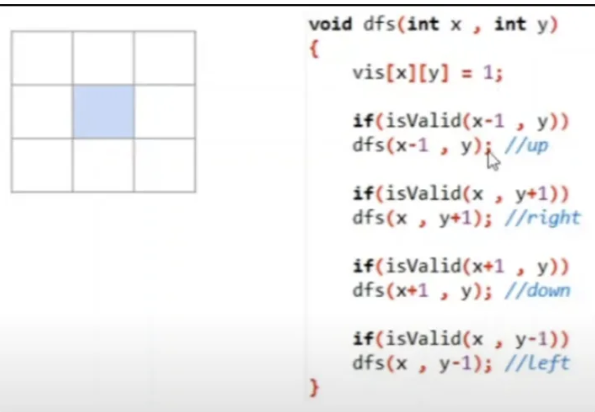
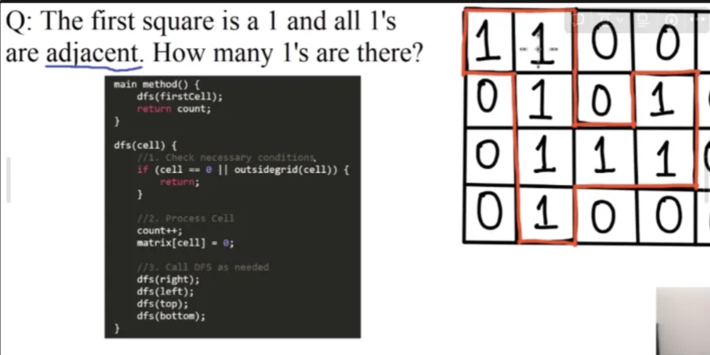

# DFS

## DFS in Grid



1. The cell that we are on (blue cell), is directly connected to four different cells (left, right, up, down) due to the **edges** of the cell.
2. We are able to make four recursive calls that goes up, down, right, or left.
    1. **NOTE:** If the corners are also considered as edges, then we must add more conditions.
3. Each cell is specified with: # of row, # of column

<br>

---

### Traversal

***Keep in mind that x is rows and y is column.***

1. Mark the current cell we are on as visited:  `visited[x][y]` 
    1. Prevents the traversal of already visited nodes
2. Before we traverse we need to check if the direction we are going to is valid.
    1. Check if the cell exists
    2. Check if there is a certain condition why we would not want to go to that cell (its a boundary, value we don't want to traverse to, etc.)
    3. Check if the cell is already visited

<br>

---

### Template Code

```python
def dfs(grid, x, y):
    # Check boundaries and if the current cell is valid for exploration
    if x < 0 or x >= len(grid) or y < 0 or y >= len(grid[0]) or not isValid(grid, x, y):
        return
    
    # Process the current cell
    # For example, mark it as visited (this might vary depending on the problem)
    markAsVisited(grid, x, y)
    
    # Explore neighboring cells (up, down, left, right)
    # Optionally, include diagonals or other specific movements based on the problem
    dfs(grid, x+1, y)  # Down
    dfs(grid, x-1, y)  # Up
    dfs(grid, x, y+1)  # Right
    dfs(grid, x, y-1)  # Left

def isValid(grid, x, y):
    # Implement the condition to determine if the current cell is valid for exploration
    # Example condition: cell is not visited and is of a specific type (e.g., land)
    return grid[x][y] == 1

def markAsVisited(grid, x, y):
    # Mark the cell as visited to avoid revisiting
    # The mechanism to mark it will depend on the problem's requirements
    grid[x][y] = 0  # Example: mark visited cells by changing their value
```

<br>

---

### Example



<br><br>

---

# BFS

## BFS in Grid


Similar to DFS, we traverse in multiple different directions. Up, right, left, down or corners as well if its part of the requirements

<br>

---

### Traversal

1. Mark visited nodes (cells)
2. Continuously adds all edges to queue
3. Pops the node and checks if the node is valid to traverse to, else continue

Think of it as a burst traversal compared to DFS that goes as deep as possible

<br>

---

### Template Code Normal Traversal

```python
def bfs(grid, start_row, start_col):
    if not isValid(grid, start_row, start_col):
        return  # Starting point is not valid

    # Directions for moving up, down, left, and right
    directions = [(-1, 0), (1, 0), (0, -1), (0, 1)]
    # Optionally, include diagonals: directions += [(-1, -1), (-1, 1), (1, -1), (1, 1)]
    
    queue = deque([(start_row, start_col)])

    while queue:
        row, col = queue.popleft()
        
        # Process the cell at (row, col)...
        if not isValid(grid, new_row, new_col):
		        continue
		   
        markAsVisited(grid, row, col)
        
        # Explore all possible directions
        for dr, dc in directions:
            new_row, new_col = row + dr, col + dc
            queue.append((new_row, new_col))

def isValid(grid, row, col):
    # Check if (row, col) is within the grid and is a cell we want to explore
    return 0 <= row < len(grid) and 0 <= col < len(grid[0]) and grid[row][col] == 1

def markAsVisited(grid, row, col):
    # Update the cell to indicate it has been visited
    # This example sets visited cells to 0, adapt as needed based on the problem
    grid[row][col] = 0
```

<br>

---

### Template Code Level Order Traversal

```python
from collections import deque

def bfs(grid, start_row, start_col):
    if not isValid(grid, start_row, start_col):
        return  # Starting point is not valid

    # Directions for moving up, down, left, and right
    directions = [(-1, 0), (1, 0), (0, -1), (0, 1)]
    # Optionally, include diagonals: directions += [(-1, -1), (-1, 1), (1, -1), (1, 1)]
    
    queue = deque([(start_row, start_col)]) 
    
    # MAKE SURE TO MARK THE BEGINNING NODE AS VISITED
    markAsVisited(grid, start_row, start_col)  # Mark the start position as visited initially

    while queue:
        level_size = len(queue)  # Get the current level size
        for _ in range(level_size):
            row, col = queue.popleft()
            
            # Process the cell at (row, col)...
            # Perform any required action with the current cell, e.g., check, modify
            
            # Explore all possible directions
            for dr, dc in directions:
                new_row, new_col = row + dr, col + dc
                if isValid(grid, new_row, new_col):
                    markAsVisited(grid, new_row, new_col)  # Mark as visited before enqueueing
                    queue.append((new_row, new_col))

def isValid(grid, row, col):
    # Check if (row, col) is within the grid and is a cell we want to explore
    return 0 <= row < len(grid) and 0 <= col < len(grid[0]) and grid[row][col] == 1

def markAsVisited(grid, row, col):
    # Update the cell to indicate it has been visited
    # This example sets visited cells to 0, adapt as needed based on the problem
    grid[row][col] = 0
```