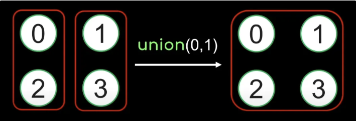
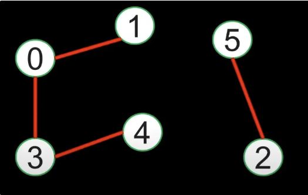
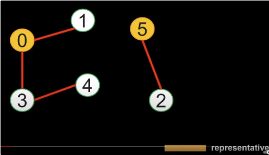
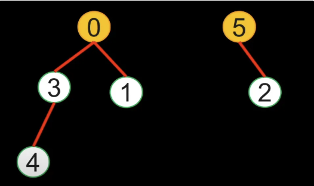
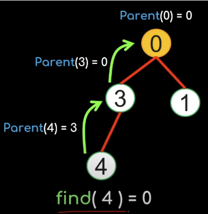
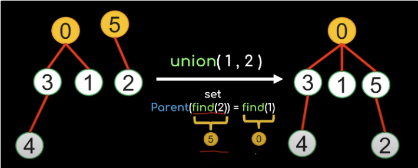
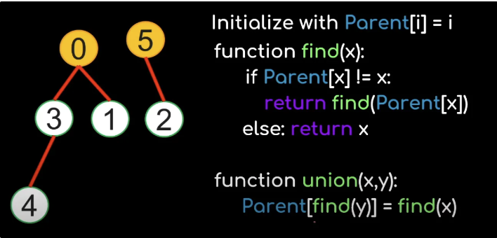

# In-depth Video

Watch Youtube video: https://www.youtube.com/watch?v=wU6udHRIkcc

Disjoint sets and operations

1. Detecting a cycle
2. Graphical Representation
3. Array Representation
4. Weighted Union and Collapsing Find
    1. Helps find root of a tree graph using an array
    2. Direct linking of a node to the direct parent of a set is a collapsing find (e.g, 1 is parent node and it connects 1 → 7 → 8, we can collapse it so that it is 1 → 8 and 1 → 7)

# Union Find

## What is it?

- **Union**: Combine two sets into one.
- **Find**: Determine which set a particular element belongs to.

<br>

## Common Applications

- **Detecting cycles** in undirected graphs.
    - **Initialization**: Initialize the Union-Find data structure.
    - **Union Operation**: For each edge in the graph, perform a union operation.
    - **Cycle Detection**: If the union operation connects two vertices that are already in the same component, a cycle is detected.
- **Kruskal’s algorithm** for finding the Minimum Spanning Tree (MST).
- **Connected components** in graphs.
- **Dynamic connectivity** problems.

<br>

## Complexities

Time Complexity: O(log n)

Best Case Time Complexity with Path Compression and Rank: *O*(*α*(*n*))

Space Complexity: O(n)

- Without optimizations, Union Find **`find`** operations could be *O*(log*n*) in the worst case.
- With path compression and union by rank (or size), the time complexity is improved to *O*(*α*(*n*)), which is nearly constant and much better than *O*(log*n*) for all practical numbers of elements *n*.

<br>

## Path Compression

- **Purpose**: To find the root of the set we compress the path to the root to make future operations faster.
- **Path Compression**: During the find operation, we make each node on the path from current node to the root point directly to the root. This flattens the structure, reducing the time complexity of future find operations.

Example:

```python
Path Compression Visualization:

Before Find(3):
   0
  /|\
 1 2 4
   |
   3

After Find(3):
   0
  /|\ \
 1 2 3 4

def find(self, x):
  # Check if the index equals its value (it is its own root node, 
						  # does not point to another root)
  if self.root[x] != x:
      # Go as deep as possible to find the root node
          # (the node where its index equals its value)
          # E.g. [0, 0, 1] , index 2 (root 2) points to index 1, index 1 points to index 0
              # 0 is the parent node of all nodes
      self.root[x] = self.find(self.root[x])
  return self.root[x]
```

<br>

## Ranks

Rank is used to approximate the tree height of the current root.

To union by rank:

- **Purpose**: To merge two sets into one.
- **Union by Rank**: To keep the tree flat, we always attach the smaller tree (lower rank) under the root of the larger tree (larger rank). The rank is used to approximate the tree height.
- If the ranks are equal, we arbitrarily choose one root and increase its rank by 1. This ensures that the resulting tree remains balanced.

Example:

```python
Initial:
0  1  2  3  4

Union(0, 1):
0-1  2  3  4

Union(2, 3):
0-1  2-3  4

Union(0, 4)
0-1-4 2-3

Union(1, 2):
   0
  /|\
 1 2 4
   |
   3
```

## How it Works

From: https://www.youtube.com/watch?v=ayW5B2W9hfo

**Function 1)** `find(x)` Find the group x belongs to

**Function 2)** `union(x, y)` Unions the groups containing x and y



**Example)** We can `find(2)` = 0 and `find(3)` = 1, then we can `union(0, 1)` to combine the two groups.

## How to Implement for Graphs

**First Function `find()`**

**Step 1)** Create edges for a vertices and connect them in different groups.



**Step 2)** Designate a representative vertex for the different groups. Representatives finds out if two different vertices belong to the same group.



Example: `find(4)` = 0 and `find(2)` = 5

**Second Function `union()`**

**Step 3)** Rearrange the graph so that the groups are now trees.



The root nodes will be the designed representatives. We now have a parent and child representation.

**Step 4)** To find the representative node, we need to traverse up the tree.



**Step 5)** To union two trees, we can just set the root of one tree as a child of the other tree.



## Code Template



1. Create the find function, finds the root of the tree.
    1. If the parent of x is not itself then we have not yet find the root of the tree
    2. Travel up the tree by recursively calling the find function until we find the parent
2. Then create the union function
    1. First we find the root of y and the root of x and change parents of the trees

```python
# IF size is given
class UnionFind:
    def __init__(self, size):
		    # Initializes each element's parent to itself and rank to 1
		    
		    # Parent of each element is itself initially
			    # E.g. [0, 1, 2, 3, 4], index 0 (root 0) is parent of itsself, etc
        self.root = [i for i in range(size)]
        
        # Rank (approx. height) of each tree is 1 initially
	        # E.g. [1, 1, 1, 1, 1]
        self.rank = [1] * size

    def find(self, p):
        # Path compression
	        # Make the tree flat by making every node point directly to the root
	        # Check if the index equals its value (it is its own root node, does not point to another root)
        if self.root[p] != p:
		       # Recursively find the root and compress path
		       # Go as deep as possible to find the root node
              # (the node where its index equals its value)
              # E.g. [0, 0, 1] , index 2 (root 2) points to index 1, index 1 points to index 0
                  # 0 is the parent node of all nodes
            self.root[p] = self.find(self.root[p])  
        return self.root[p]  # Return the root of the set containing p

    def union(self, x, y):
        """Unites the sets that x and y belong to, by rank."""
        rootX = self.find(x)
        rootY = self.find(y)
        
        # If roots are different, we need to union them (join them together)
        # Union by using ranks
        if rootX != rootY:
		        # Attach the smaller tree to the root of the larger tree to keep the tree flat
            if self.rank[rootX] > self.rank[rootY]:
		            # Attach smaller rank tree under root of higher rank tree
                self.root[rootY] = rootX
            elif self.rank[rootX] < self.rank[rootY]:
		            # Attach smaller rank tree under root of higher rank tree
                self.root[rootX] = rootY
            else:
		            # If ranks are equal, arbitrarily choose one as the root and increase its rank
		            # Because the longest path in each tree is now part of the longest path in the new tree, resulting in a taller tree.
                self.root[rootY] = rootX
                self.rank[rootX] += 1

    def connected(self, x, y):
        """Checks if x and y are in the same set."""
        return self.find(x) == self.find(y)
 
 # If size is not given:
 class UnionFind:
    def __init__(self):
    # IMPORTANT:
    # IMPORTANT:
    # IMPORTANT:
    # If we can guarantee that edges are unique and the connections are valid
    # Then we can use the length of edges + 1 in an array
        self.root = {}  # Maps an element to its parent
        self.rank = {}  # Maps an element to its rank

    def find(self, x):
        """Finds the root of the set that x belongs to, with path compression."""
        if x not in self.root:
            self.root[x] = x  # Initialize with itself as root
            self.rank[x] = 1  # Initialize rank
        if x != self.root[x]:
            self.root[x] = self.find(self.root[x])  # Path compression
        return self.root[x]

    def union(self, x, y):
        """Unites the sets that x and y belong to, by rank."""
        rootX = self.find(x)
        rootY = self.find(y)
        if rootX != rootY:
            if self.rank[rootX] > self.rank[rootY]:
                self.root[rootY] = rootX
            elif self.rank[rootX] < self.rank[rootY]:
                self.root[rootX] = rootY
            else:
                self.root[rootY] = rootX
                self.rank[rootX] += 1

    def connected(self, x, y):
        """Checks if x and y are in the same set."""
        # Only check connection if both elements have been added
        if x in self.root and y in self.root:
            return self.find(x) == self.find(y)
        return False

```

## Example of Code in Action

Let's go through the Union-Find data structure step by step, starting from initialization to the point where nodes are connected through union operations. We'll visualize the `parent` and `rank` arrays at each step.

### Initialization

Assume we have 5 elements (0 to 4).

```python
uf = UnionFind(5)
```

At initialization:

- `parent`: [0, 1, 2, 3, 4]
    - Each element is its own parent.
- `rank`: [1, 1, 1, 1, 1]
    - Each element is a tree of height 1.

### After Union Operations

### Union(0, 1)

```python
uf.union(0, 1)
```

- Find roots of 0 and 1:
    - Root of 0 is 0.
    - Root of 1 is 1.
- Union by rank:
    - Both have the same rank. Arbitrarily choose 0 as the root and increase its rank.

Updated `parent` and `rank`:

- `parent`: [0, 0, 2, 3, 4]
    - 1's parent is now 0.
- `rank`: [2, 1, 1, 1, 1]
    - Rank of 0 increases to 2.

## Example - Counting Connected Components (Leetcode 323)

```python
class UnionFind:
    def __init__(self, size):
        self.parent = [i for i in range(size)]
        self.rank = [1] * size
    
    def find(self, x):
        """Finds the root of the set that x belongs to, with path compression."""
        # Return value if the node equals itself
        if self.parent[x] == x:
            return x
        # If node does not equal itself, recursively find the parent then compress the path
            # It will point the child directly to parent node instead of creating a linked list
        self.parent[x] = self.find(self.parent[x])
        return self.parent[x]
    
    def union(self, x, y):
        rootX = self.find(x)
        rootY = self.find(y)

        if rootX != rootY:
            # Connect the root to the greatest rank between the two roots
                # This also prevents a linked list from happening to the parent node
            if self.rank[rootX] > self.rank[rootY]:
                self.parent[rootY] = rootX
            elif self.rank[rootX] < self.rank[rootY]:
                self.parent[rootX] = rootY
            else:
                self.parent[rootY] = rootX
                self.rank[rootX] += 1
    

class Solution:
    def countComponents(self, n: int, edges: List[List[int]]) -> int:
        unionFind = UnionFind(n)

        # Connect together the different roots based on edges
        for x, y in edges:
            unionFind.union(x, y)
        
        # Applying find to each node to ensure path compression
            # Creates a set of parent nodes so we can find the length of all parent nodes
            # This tells us the different groups of connections
        return len(set(unionFind.find(i) for i in range(n)))
```

## Example - Detecting a Cycle (Leetcode 684)

In the image below, (1, 5) edges will connect thus creating a cycle because they are in the same set.


```python
class UnionFind:
    def __init__(self):
        self.parent = {}
        self.rank = {}
    
    def find(self, x):
        if x not in self.parent:
            self.parent[x] = x
            self.rank[x] = 1
        if x != self.parent[x]:
            self.parent[x] = self.find(self.parent[x])
        return self.parent[x]
    
    def union(self, x, y):
        parentX = self.find(x)
        parentY = self.find(y)

        # Cycle has been detected
            # When parent nodes equal each other it means the edge that we will connect will form a cycle
            # Due to nodes pointing to parent nodes to show which group the connection it is in
            # If they are in the same group, it means the edge we are connecting will form its own connection
            # Thus creating a loop
        if parentX == parentY:
            return False
        else:
            if self.rank[parentX] > self.rank[parentY]:
                self.parent[parentY] = parentX
            elif self.rank[parentX] < self.rank[parentY]:
                self.parent[parentX] = parentY
            else:
                self.parent[parentY] = parentX
                self.rank[parentX] += 1
        
        return True

class Solution:
    def findRedundantConnection(self, edges: List[List[int]]) -> List[int]:
        uf = UnionFind()

        for x, y in edges:
            if not uf.union(x,y):
                return [x,y]
        
        return []
```